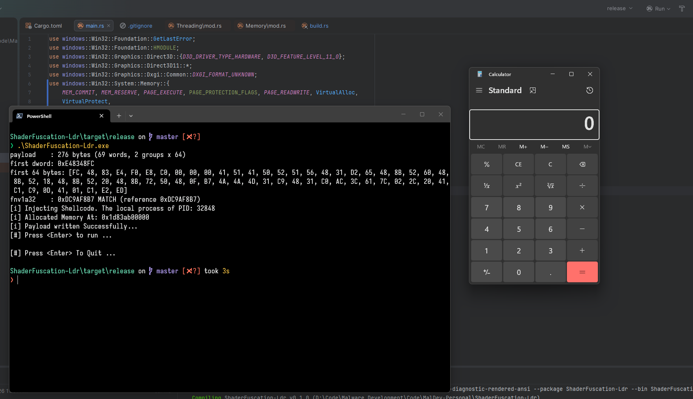

# Polychrome
This is a example on how to embed a payload into a compute shader.
The payload is encrypted and decrypted on the GPU.

This is not by any means a complete implementation it misses crucial OPSEC considerations.

## Usage
Generate a payload using your preferred method i used the classic calc.exe as an example.
Then use the python script `polychrome.py` to generate the shader code.
```bash
python3 polychrome.py <path_to_payload> -t both --meta -n payload
```
Then you should have a shader file like a`.hlsl`
To use it we need to compile it first.
```bash
fxc /T cs_5_0 /E CSMain /O3 /Fo payload.cso payload.hlsl
```

Move the `payload.cso` file and `payload.meta.json` file to the `resources` directory.

The compile the rust project, the payload is embedded into the exectable:
```bash
cargo build --release
```
## Example output:

